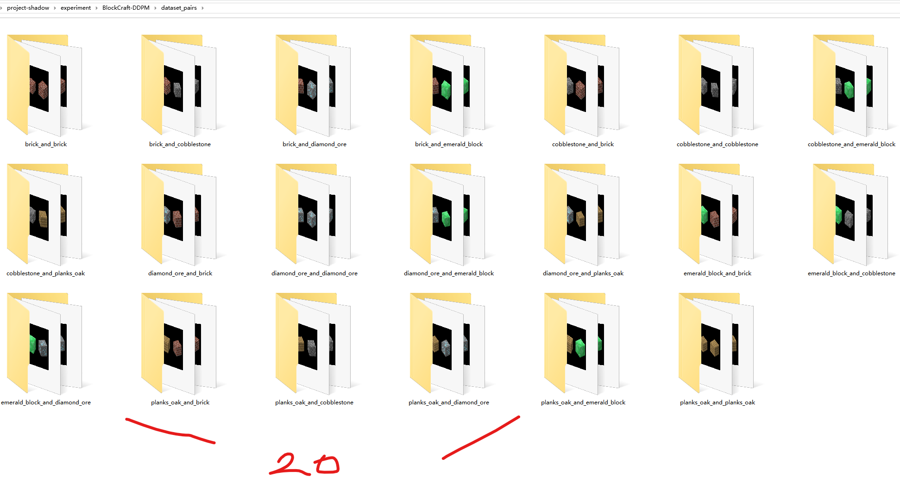

## BlockCraft-DDPM 实验指导手册

### 提取方块贴图

首先找到`.minecraft`文件夹，如果找不到这个文件夹的话，可以用`everything`搜一下。


在这个文件夹当中任意选择一个版本，其中会有一个类似于`1.12.2.jar`的文件，把这个文件的后缀改成zip。


然后会发现可以直接解压，解压之后在这个路径就可以找到各种各样的贴图(我把解压之后的文件夹重命名为了1.12.1.jar)

```shell
assets\minecraft\textures
```


进入到blocks文件夹，当中就有方块的贴图


这个文件夹当中除了图片，还会有一些 metadata的文件，但是他对我们没有用，如果有强迫症可以把它移除。

```shell
del /f /s /q *.mcmeta
```


最后我把总共400多张贴图放到了block textures文件夹当中，放在了根目录。

### 方块选择

如果一次选择400多个方块，显然会增加训练难度。

钻石矿和钻石块在语义空间上相距较近，而红石块和红砖在图像空间上相距较近，会增加训练难度。

选择纹理过于细微的方块比如说黑曜石，可能难以把黑曜石中的光泽学习到。

如果选择每个面不一样的方块，比如说草方块，在合成数据这一步会有点麻烦。

为了让训练和合成更加容易，选择了5个在语义空间和图像空间上都相距较远，6面图像一致，特征明显，且不是太冷门的方块，它们分别是：

```shell
SELECTED_BLOCKS = [
    "diamond_ore.png", # 钻石矿
    "emerald_block.png", # 绿宝石块
    "brick.png", # 红砖块
    "cobblestone.png", # 圆石
    "planks_oak.png", # 橡木板
]
```

###  合成增强

本数据集不同于四叶草数据集，四叶草数据集更多的是一个2d图像，并且有旋转对称性。本数据集是3d的，并且没有旋转对称，如果采取旋转的数据增强的方式，会破坏它原来合理的透视结构。

因此，方块数据集采取了合成增强，也就是在生成图片的时候就引入一些随机性，而不是生成之后再进行调整。

在合成期间左右的旋转角有一定的随机性，俯仰角有微小的随机性，尺寸大小也有一定的随机性。此外，光影也有一定的随机性，也就是不同面的亮度会稍微的不一样。

执行合成增强的脚本，在此之前需要安装一下numpy这类环境，不过这类环境太经典了，所以不多赘述。

```shell
python synthetic_augment.py
```


如图可以看到每一个绿宝石块都是有一些区别的，包括左右角、仰角、大小和阴影的亮暗。

和四叶草数据集还有一个不同点就是:方块数据集的重复性更高，也就是说绿宝石块之间的差异比起四叶草之间的差异更小，这就意味着我们没有必要把数据生成到2000个绿宝石块。我们完全可以只生成200个绿宝石块，但是训练的轮数乘以10，这两种方案模型看到的都是2000个绿宝石块，并且区别不大。

因此每一种方块都只生成了200个，总共有1000个。


### 合成增强-方块对

由于背景都是黑色的，所以想要生成方块对的时候，只需要把两个方块直接贴到一个黑色背景当中，在高度上居中对齐，在宽度上只有原来的一半。

```shell
python pair_synthetic_augment.py
```

效果是生成20种方块的组合，可能是钻石矿和钻石矿的组合，也可能是钻石矿和绿宝石矿的组合。其中方块的左右是有区别的，也就是说圆石和红砖，红砖和原石是不一样的。

为了防止让模型看到的几乎都是方块对，选择让单个方块的数量和双方块的数量比例是1:1。也就是生成总共1000个方块对，其中每种方块对生成50个，总共有20种方块对，去掉了其中的5种组合。

这5种被排除的组合分别是：

```shell
EXCLUDED_PAIRS = [
    ("emerald_block", "planks_oak"),
    ("brick", "planks_oak"),
    ("diamond_ore", "cobblestone"),
    ("cobblestone", "diamond_ore"),    # 完全没有见过的钻石+圆石组合能否生成出来？
    ("emerald_block", "emerald_block")  # 没有见过的自己和自己组合，能否生成出来？
]
```



### 租服务器


### 远程登录服务器


### 下载github仓库

先给联网加个速[只在当前端口生效] [服务器不方便配置代理]

```shell
source /etc/network_turbo
```

下载仓库

```shell
git clone https://github.com/HaiPenglai/BlockCraft-DDPM
```

安装没有预装的库

```shell
pip install accelerate diffusers
```

