## BlockCraft-DDPM 实验指导手册

### 提取方块贴图

首先找到`.minecraft`文件夹，如果找不到这个文件夹的话，可以用`everything`搜一下。

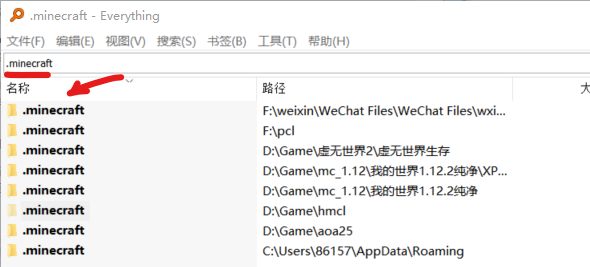

在这个文件夹当中任意选择一个版本，其中会有一个类似于`1.12.2.jar`的文件，把这个文件的后缀改成zip。

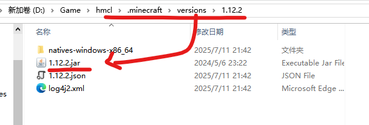

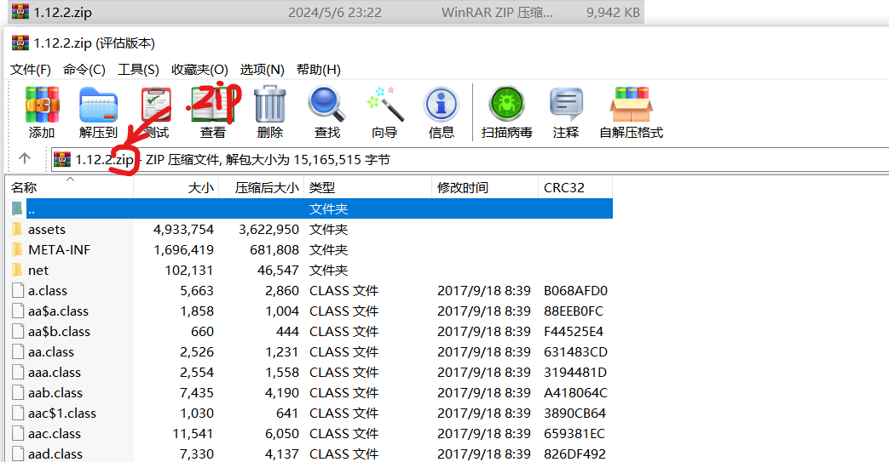

然后会发现可以直接解压，解压之后在这个路径就可以找到各种各样的贴图(我把解压之后的文件夹重命名为了1.12.1.jar)

```shell
assets\minecraft\textures
```

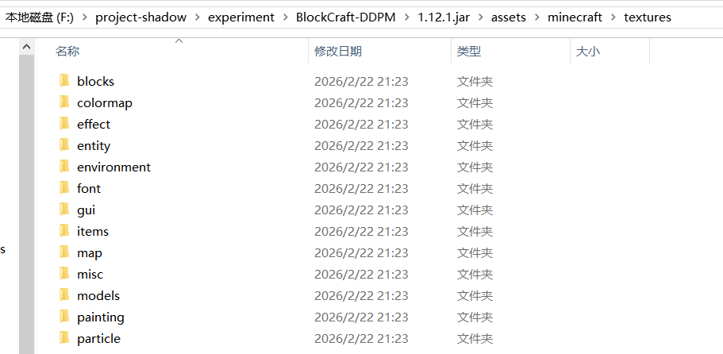

进入到blocks文件夹，当中就有方块的贴图

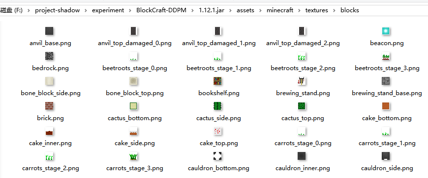

这个文件夹当中除了图片，还会有一些 metadata的文件，但是他对我们没有用，如果有强迫症可以把它移除。

```shell
del /f /s /q *.mcmeta
```

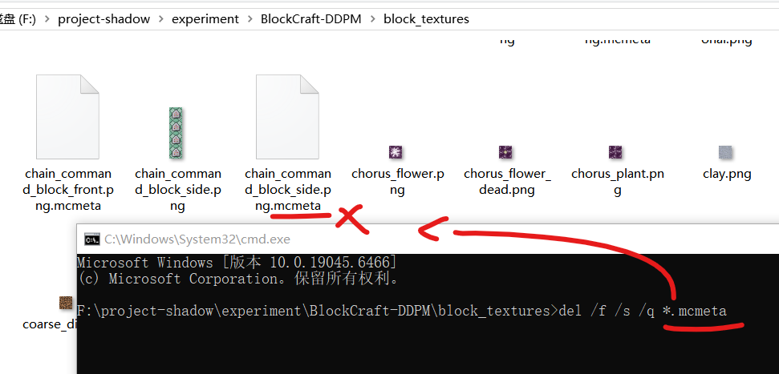

最后我把总共400多张贴图放到了block textures文件夹当中，放在了根目录。

### 方块选择

如果选择各个面不一样的方块，合成的时候有点折腾。因此选择了各个面都一样的以下几种常见方块。

```shell
    tasks = [
        "diamond_ore", # 钻石矿
        "emerald_block", # 绿宝石块
        "brick", # 红砖块
        "cobblestone", # 圆石
        "planks_oak", # 橡木板
        "stone",            # 石头
        "dirt",             # 泥土
        "sand",             # 沙子
        "gravel",           # 沙砾
        "bedrock",          # 基岩
        "iron_ore",         # 铁矿石
        "gold_ore",         # 金矿石
        "coal_ore",         # 煤矿石
        "lapis_block",      # 青金石块
        "obsidian",         # 黑曜石
        "glass",            # 玻璃 (透明特征学习)
        "stonebrick",       # 石砖
        "netherrack",       # 下界岩
        "bookshelf",        # 书架 (纹理较复杂，适合挑战模型)
        "glowstone",        # 萤石 (高亮度和复杂纹理)
    ]
```

###  合成增强

在合成期间左右的旋转角有一定的随机性，俯仰角有微小的随机性，尺寸大小也有一定的随机性。此外，光影也有一定的随机性，也就是不同面的亮度会稍微的不一样。

执行合成增强的脚本，在此之前需要安装一下numpy这类环境，不过这类环境太经典了，所以不多赘述。

```shell
python synthetic_augment.py
```

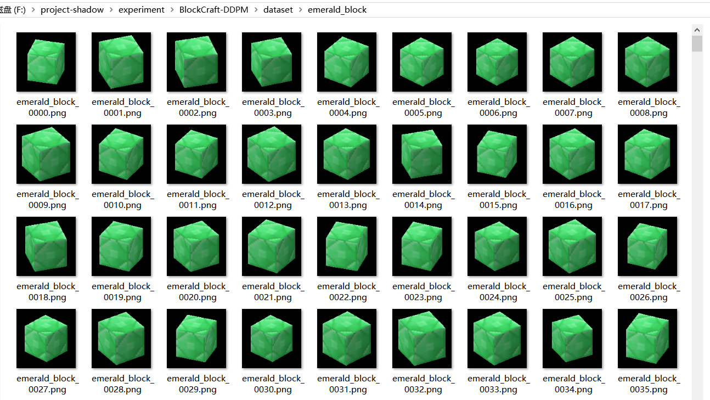

如图可以看到每一个绿宝石块都是有一些区别的，包括左右角、仰角、大小和阴影的亮暗。

和四叶草数据集还有一个不同点就是:方块数据集的重复性更高，也就是说绿宝石块之间的差异比起四叶草之间的差异更小，这就意味着我们没有必要把数据生成到2000个绿宝石块。我们完全可以只生成100个绿宝石块，但是多训练几轮。

因此每一种方块都只生成了100个，总共有2000个。

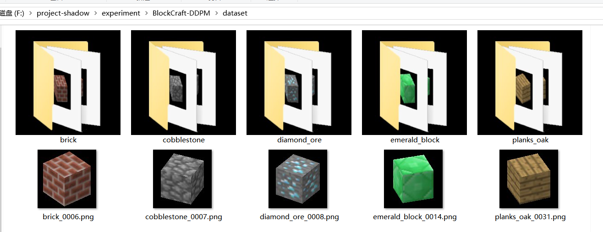

### 租服务器


### 远程登录服务器


### 下载github仓库

先给联网加个速[只在当前端口生效] [服务器不方便配置代理]

```shell
source /etc/network_turbo
```

下载仓库

```shell
git clone https://github.com/HaiPenglai/BlockCraft-DDPM
```

安装没有预装的库

```shell
pip install accelerate diffusers
```

### 训练

开始训练

```shell
python train.py
```

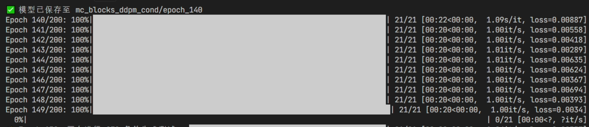

### 训练监控

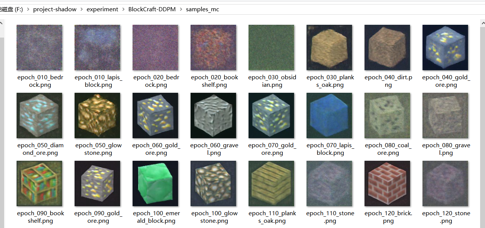

每10轮会进行一次生成测试，可以看到模型从不太学会生成到学会生成，从比较模糊到逐渐边缘清晰。

### 推理

可以在generate.py文件当中选择使用的模型的轮数。

```shell
python generate.py
```

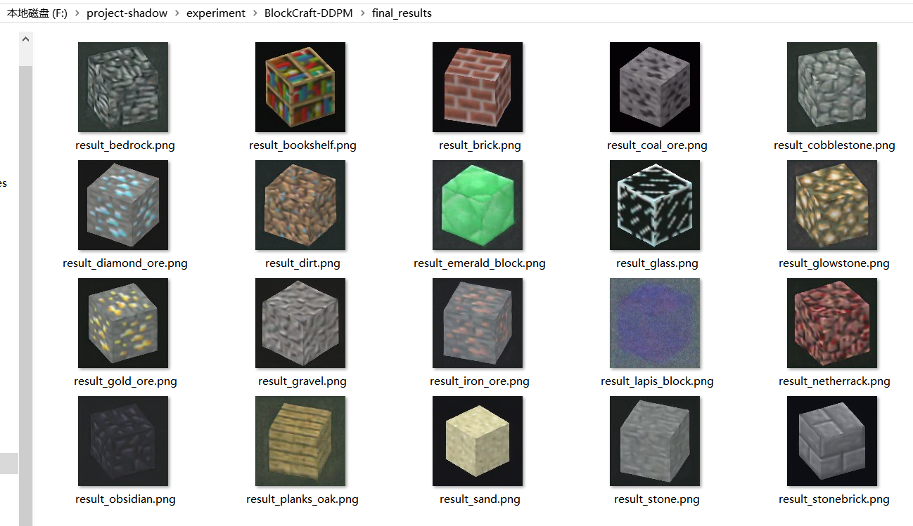

可以看到除了青金石，生成的结果都还不错。左右的角度也是各有不同的。

### 特征融合

可以在`fusion_generate.py `文件当中选择要融合的方块。

```shell
python fusion_generate.py 
```

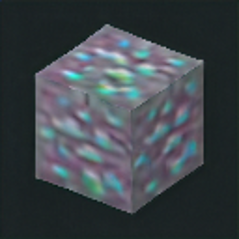

比如说融合钻石矿和绿宝石块会得到一个泛着绿光的钻石矿。

### 上传数据集

首先要获取一个hugging face的token，然后登录，然后就可以上传数据集了，之前说过不再赘述。模型也是一样的。

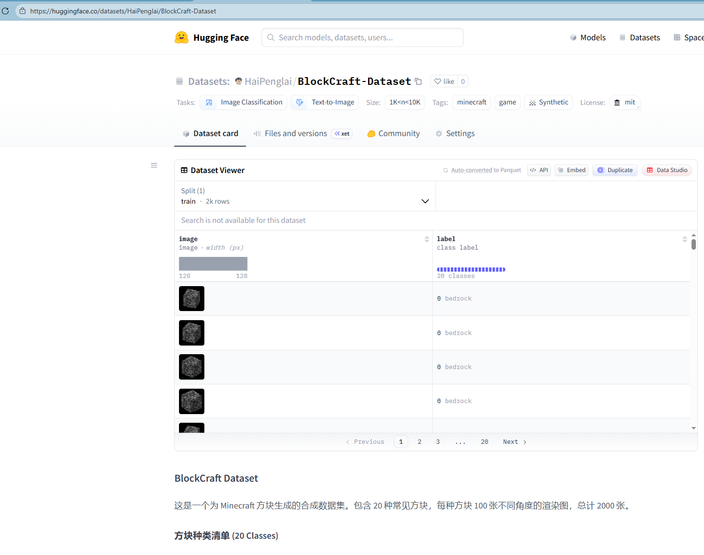

### 上传模型

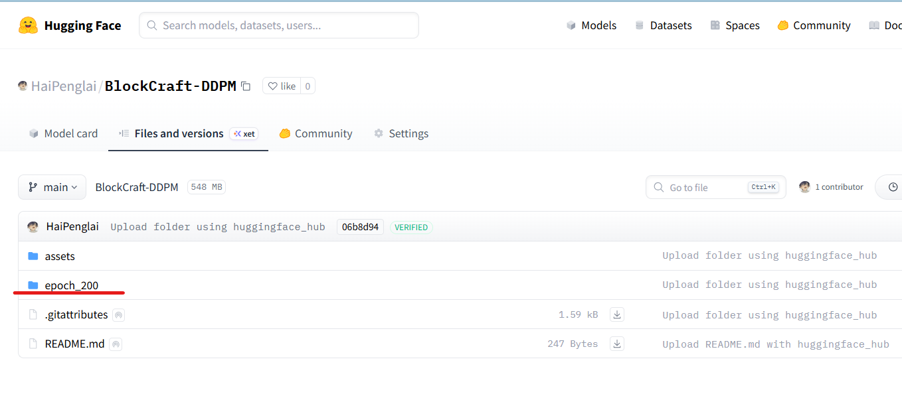
